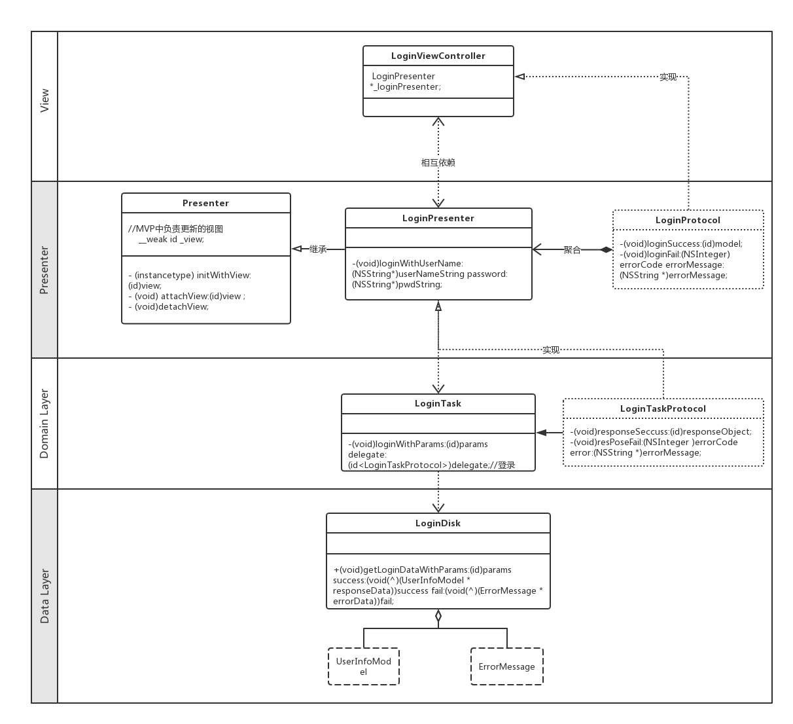

# MVPCleanDemon

## Example

### LoginDemon（MvpClean）

MVP+Clean 结构实现的登录模块Demon，为了更好的理解MVP + Clean 架构。类图如下：

- 首先，整体上理解，MvpClean 是一个垂直向下依赖结构。层与层之间通过接口实现解耦，从而可实现灵活组合。
- 在实际开发中，Data Layer 对应于网络层+数据层，即 对外提供给Domain所需原始数据，Domain不去管数据是从服务器获取还是从本地缓存获取。
- Domain将原始数据处理成可供View直接展示的数据，即 在这里根据业务逻辑处理数据，每个业务对应一个UserCase。
- Presenter将Domain的数据结果展示到View上。
- 拿“登录”来讲，用户点击View上的登录按钮，Presenter首先收到响应，然后Presenter直接调用LoginTask（UserCase）的登录方法；
- LoginTask向LoginDisk去拿登录数据，LoginDisk 先检测本地是否存在缓存数据，如果存在返回缓存数据，如果不存在去服务器请求；
- LoginTask返回数据给LoginTask，Presenter通过接口接收到LoginTask的返回数据，再展示到View上。

## Requirements

## Installation

## Author
yuxueliang, xueliangwd@163.com

## License

GomeShop is available under the MIT license. See the LICENSE file for more info.
